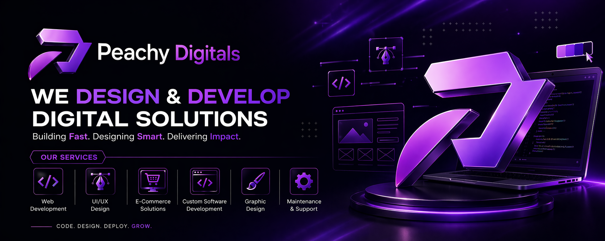

  

---

## ✦ About Us

**Peachy Digitals** is a creative software house dedicated to turning ideas into premium digital experiences. We combine strategy, design, and development to help brands build a stronger digital presence with solutions that are not only visually refined, but also practical, scalable, and results-driven.

Our approach is centered around understanding each client's vision, audience, and business goals before crafting tailored digital products that truly represent their brand. From modern websites and user-focused interfaces to custom software and creative brand assets, we aim to deliver work that feels polished, purposeful, and future-ready.

At Peachy Digitals, we believe great digital products are built through a balance of creativity and functionality. That is why every project we take on is shaped with attention to detail, clean execution, and a commitment to long-term value. We do not just build for launch day — we build with growth, consistency, and brand impact in mind.

---

## ✦ Our Services

<table>
  <tr>
    <td width="33%" align="center">
      
        
      <strong>Web Development</strong>
        
      Modern, responsive, and high-performance websites built to strengthen your digital presence and support business growth.
    </td>
    <td width="33%" align="center">
      
        
      <strong>UI/UX Design</strong>
        
      Intuitive and visually polished user experiences designed to improve usability, engagement, and conversion.
    </td>
    <td width="33%" align="center">
      
        
      <strong>E-Commerce</strong>
        
      Scalable online stores with seamless shopping experiences, optimized layouts, and conversion-focused design.
    </td>
  </tr>
  <tr>
    <td width="33%" align="center">
      
        
      <strong>Custom Software</strong>
        
      Tailored software solutions designed around your business workflow, operational needs, and long-term goals.
    </td>
    <td width="33%" align="center">
      
        
      <strong>Graphic Design</strong>
        
      Creative visual assets and brand-focused design work that help businesses communicate with clarity and style.
    </td>
    <td width="33%" align="center">
      
        
      <strong>Maintenance & Support</strong>
        
      Ongoing updates, monitoring, and technical support to keep your digital products secure, smooth, and reliable.
    </td>
  </tr>
</table>

---

## ✦ Tech Stack

  
  
  
  
  
  
  
  
  
  
  
  
  
  
  

---

## ✦ Why Choose Us

- Modern, refined, and brand-focused design approach  
- Scalable and maintainable development standards  
- Strong attention to user experience and visual detail  
- Solutions tailored to real business needs  
- Reliable communication and long-term support mindset  

---

## ✦ What We Build

- Business Websites  
- Portfolio Websites  
- Admin Dashboards  
- E-Commerce Stores  
- Brand Identity Assets  
- Custom Web Applications  

---

## ✦ Connect With Us

  
  &nbsp;&nbsp;&nbsp;
  
  &nbsp;&nbsp;&nbsp;
  
  &nbsp;&nbsp;&nbsp;
  
  &nbsp;&nbsp;&nbsp;
  
  &nbsp;&nbsp;&nbsp;
  

---

  <strong>From dreams to brand reality - Let's create something Peachy together!</strong>

  Made with 💜 by Peachy Digitals

